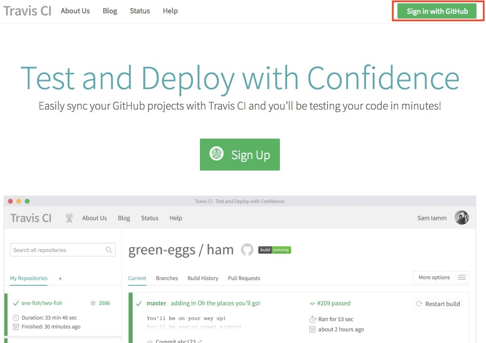
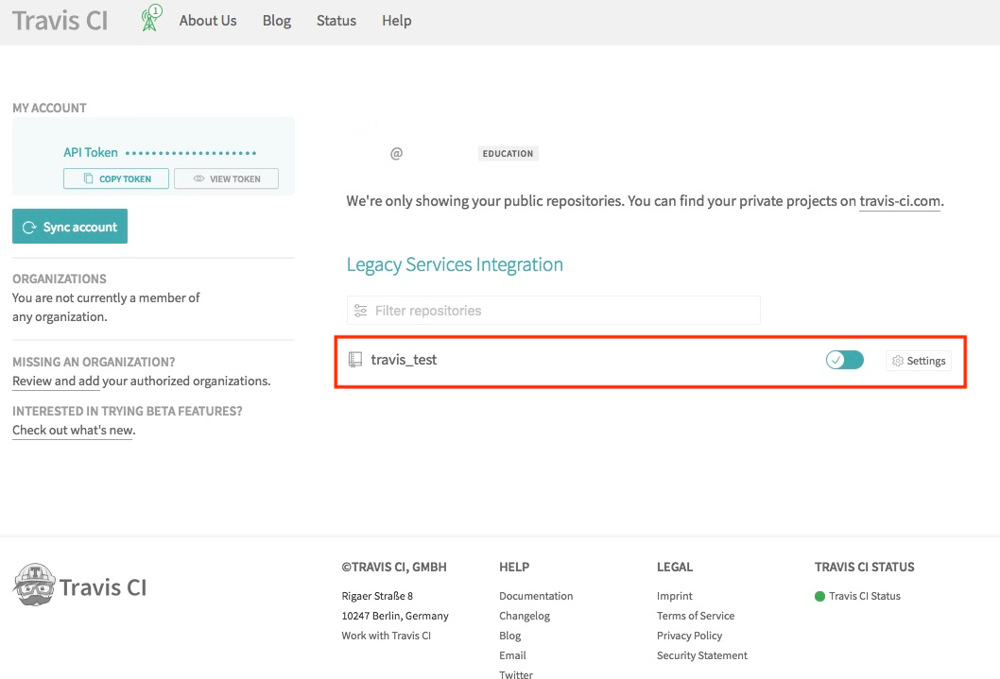
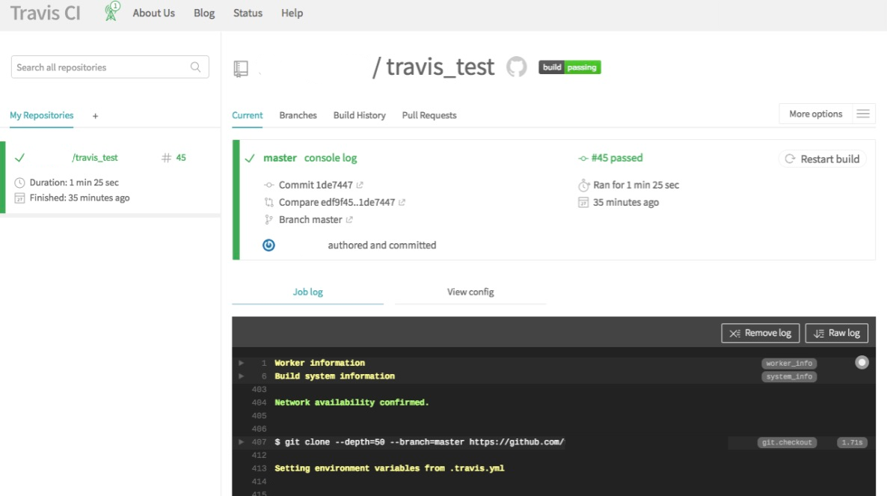
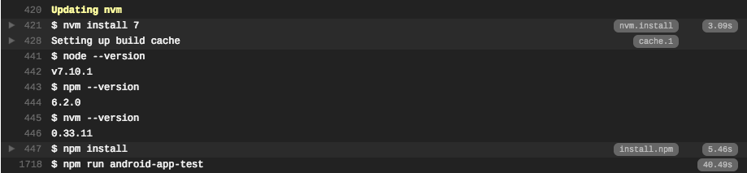

# Triggering a Travis build from a push to Github
This guide will demonstrate how to get Travis CI to build your project everytime your source code is changed and pushed to Github.

## 1 Sign in to Travis CI with your Github account
- Go to www.travis-ci.org and click on the "Sign in with Github" button in the upper right corner of the screen


- Enter your Github username and password then click "Sign in"


## 2 Sync your Github repository with Travis CI
- You can see a list of your Github repositories on the right column. Click on the switch next to your repository's name to sync it to Travis CI.


> This guide will use the "travis_test" repository as an example.

## 3 Configure .travis.yml file
- In order to enable Travis CI to build our project, create a configuration file in your Github repository folder.
- Create a `.travis.yml` file in your project that includes the following information.  

```
language: node_js
node_js:
  - '7'
script: npm run android-app-test
```

There are 3 major elements in the yml file as mentioned above:
- `language`: define the programming language of your project.  
```
  Other examples:
  - C#: csharp
  - Java: java
  - Python: python
```

- `node_js`: define the version of your language. In this case, we use Node version 7.
- `script`: the main script for Travis CI to run. This is where you put your automation test script in.

Save the file and push your commit to Github.
Go to repository on Travis to verify the changes.

  
  

------
Next part will demonstrate [how to run Kobiton automation test on Travis](2-run-kobiton-test.md)
