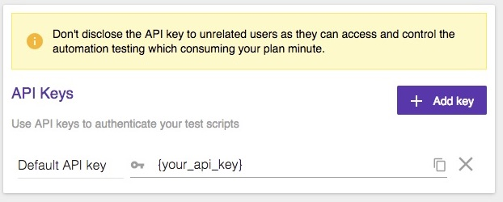
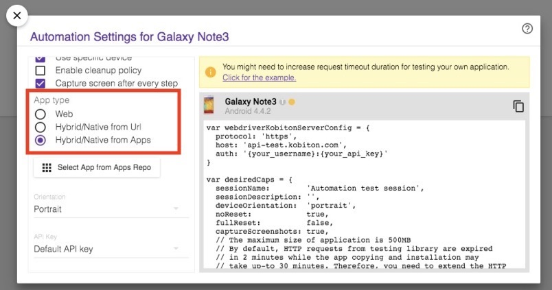

# Run Kobiton Automation Test on Travis CI
This guide will teach you how to run your Kobiton test on Travis CI and how to secure your secret environment variables.

## 2.1 Prepare your Kobiton username and API key for Automation Testing
### 2.1.1 Go to Kobiton Portal and click on your Account Name on the upper right corner
  - You can see your username on the dialog below.

### 2.1.2 Click on your Account Name and select "Settings"
  - Copy your API key from the textbox.

## 2.2 Configure environment variables in your .travis.yml file
### 2.2.1 There are 3 methods to attach an enviroment variable to Travis CI.
  - If it is public and is the same on every branch, add it to your .travis.yml
  - If it contains sensitive information (i.e API Key) but is the same on every branch, add it to Travis CI Repository Settings
  - If it contains sensitive information (i.e API Key) and might be different for different branches, encrypt it first and add to your .travis.yml

In this guide, we will add our Username and API key to our .travis.yml file. The API Key will be encrypted for security purposes.

### 2.2.2 Configure your .travis.yml 
#### Configure username 
- In your .travis.yml, add these lines above the script tag
~~~
env:
  global:
    - KOBITON_USERNAME={your_username_here}
~~~

#### Config API key
1. We will encrypt our API key using the `travis` gem.
2. Run `gem install travis` on console command to install `travis`
3. In your repository directory, run:
`travis encrypt KOBITON_API_KEY={your_api_key_here} --add env.global`
4. This will add a secure encrypted key to your .travis.yml

~~~
env:
  global:
    - KOBITON_USERNAME={your_username_here}
    - secure: fiMW+BqOmyxvf47dJBvmEqRRZ4r5f6TW=
~~~

### 2.2.3 Edit your automation testing script
- Get serverConfig and desiredCaps for your Kobiton device

- Edit your settings on your script
~~~
const username = process.env.KOBITON_USERNAME
const apiKey = process.env.KOBITON_API_KEY

const kobitonServerConfig = {
  protocol: 'https',
  host: 'api-test.kobiton.com',
  auth: `${username}:${apiKey}`
}

var desiredCaps = {
  sessionName:        'Automation test session',
  sessionDescription: '', 
  deviceOrientation:  'portrait',  
  noReset:            true,
  fullReset:          false, 
  captureScreenshots: true,
  app:                {your_app_id}, 
  udid:               {your_device_udid}
}
~~~

- Push your changes and let Travis CI and Kobiton do their job!

## 2.3 Use cache to improve building speed
- Travis CI will download and install your dependencies on every build attempt, which might reduce your performance if your project requires a large amount of dependencies that rarely change.
- One recommended method is to save those dependencies in caches after your first successful build.
- In NodeJS, dependencies are stored in the `node_module` folder. We will add `cache` command on .travis.yml file to save the folder as cache.
- Add these lines after `script` command, so that it will run only when our script is done.
~~~
cache:
  directories:
    - node_module
~~~

------
And that is how to run Kobiton test on Travis CI.  
On the [next issue](3-get-session-info.md), we will use Kobtion API to get testing session information.

