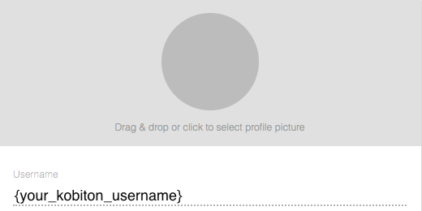

# Run Kobiton Automation Test on Travis CI
This guide will demonstrate How to run your Kobiton test on Travis CI and how to secure your secret environment variables

## Prerequisites
  - Github account.
  - Kobiton installed
  - Kobiton account and API key.

## 1. Prepare Kobiton configuration for executing automation testing
  - Go to https://portal.kobiton.com

### 1.1 Get Kobiton Username
  - In the upper right hand corner, click on User icon and in the drop down menu, click on `Profile`.  


  - You should see your username.


### 1.2 Get Kobiton API key
  - Click on User icon and select `Settings` on the drop down menu.
  

  - Copy your API key under `API Keys`.  


## 2. Configure environment variables in your .travis.yml file
There are several methods to attach an enviroment variable to Travis CI.
In this guide, we will add our Username and API key to `.travis.yml` file. The API Key will be encrypted for security purposes.

### 2.1 Configure .travis.yml file
- Encrypt API key for security purposes:
  
  1. To install `travis`, run `gem install travis` on terminal.
  2. In your repository directory, run:
    `travis encrypt KOBITON_API_KEY={your_api_key_here} --add env.global`
  3. This will add a secure encrypted key to your `.travis.yml`
  4. Add necessary value to the template.
  
```
env:
  global:
    - KOBITON_USERNAME={your_kobiton_username}
    - secure: {your_encrypted_api_key}
```

- The final outcome of `.travis.yml` file
```
language: node_js
node_js:
  - '7'

env:  
 global:
  - KOBITON_USERNAME={your_kobiton_username}
  - secure: {your_encrypted_api_key}

script: npm run android-app-test
```

## 3. Write the automation test script
- For samples of automation tests, go to https://github.com/kobiton/samples
- Choose a language for your test script, and decide whether you want to test on Android or iOS, and either do a web test or an app test. 
- Make sure in the code you specify your Kobiton username, API key, and information under desiredCaps. Here is example:
  


```javascript
const username = process.env.KOBITON_USERNAME
const apiKey = process.env.KOBITON_API_KEY


const kobitonServerConfig = {
  protocol: 'https',
  host: 'api-test.kobiton.com',
  auth: `${username}:${apiKey}`
}

var desiredCaps = {
  sessionName:        'Automation test session',
  sessionDescription: '', 
  deviceOrientation:  'portrait',  
  noReset:            true,
  fullReset:          false, 
  captureScreenshots: true,
  app:                {your_app_id}, 
  udid:               {your_device_udid}
}
```

- Push your changes to Github and verify in Travis CI.  
  

## 3. (Optional) Use cache to improve building speed
Travis CI will download and install your dependencies on every build attempt, which might reduce your performance if your project requires a large amount of dependencies that rarely change. For instance, in Node.js, dependencies are stored in the `node_module` folder.  
One recommended method is to save those dependencies in caches after your first successful build.  
Add these the command below after `script` command in `.travis.yml` file:  

```
cache:
  directories:
    - node_module
```
The final script should be:
```
language: node_js
node_js:
  - '7'

env:  
 global:
  - KOBITON_USERNAME={your_kobiton_username}
  - secure: {your_encrypted_api_key}

script: npm run android-app-test
cache:
  directories:
    - node_module
```

------
On the [next issue](3-get-session-info.md), we will use Kobtion API to get testing session information.

