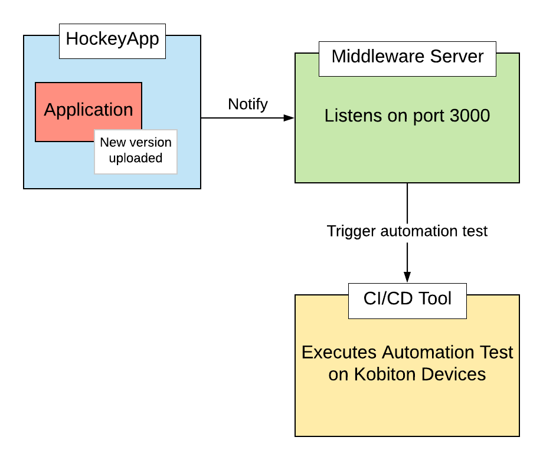

# Integrating Kobiton in Travis CI - HockeyApp development pipeline
--------

Guidance on integrating Kobiton service into the mobile app build pipeline: Travis CI, Testflight, Appium and ReactNative.  

Kobiton is an Appium supported mobile cloud platform that enables users to perform manual or automated testing on iOS and Android devices.

This guide will demonstrate how to configure Travis CI to get the latest build on HockeyApp and run Appium automation tests on Kobiton Test Cloud service.

Below is the diagram demonstrating how Kobiton integrates with your app development pipeline.

This repository has provided instructions and samples of automation test scripts and basic middleware server. Please visit [our documentation](docs/integrate-kobiton-travisci.md) for more details.
