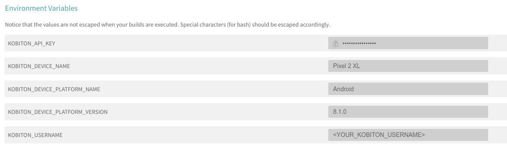

# Run Automation Test on Kobiton devices with Travis CI
This document will guide you how to use Travis CI to execute automation test on Kobiton devices everytime you push a commit to GitHub.

## Table of contents 
  - [A. Preparation](#a-preparation)
    - [1. Prerequisites](#1-prerequisites)
    - [2. Kobiton username and API key](#2-kobiton-username-and-api-key)
    - [3. Sample](#3-sample)
  - [B. Setup](#b-setup)
    - [1. Setting environment variables](#1-setting-environment-variables)
    - [2. Getting desired capabilities](#2-getting-desired-capabilities)
    - [3. Configuring automation test script](#3-configuring-automation-test-script)
    - [4. Configuring Travis CI](#4-configuring-travis-ci)
    - [5. Configuring HockeyApp WebHook listener](#5-configuring-hockeyapp-webhook-listener)
  - [C. Execution](#c-execution)
    - [1. Run automation script on Kobiton devices](#1-run-automation-script-on-kobiton-devices)
    - [2. Fetch session data through REST API](#2-fetch-session-data-through-rest-api)
  - [D. Feedback](#d-feedback)

# A. Preparation

## 1. Prerequisites
- A hosted server for receiving WebHooks with Ruby 2.x installed.
> If you haven't installed Ruby on your server, please refer to [Ruby Installation documentation](https://www.ruby-lang.org/en/documentation/installation/) on how to install Ruby on corresponding operation systems.

## 2. Kobiton username and API key

In order to execute automation test on Kobiton devices, you need to prepare your Kobiton username and API key for authenticating with Kobiton. 
  
> Please visit https://portal.kobiton.com/register to create a new Kobiton account if you do not have one.

Follow instructions at `IV. Configure Test Scripts for Kobiton` section on [our blog article](https://kobiton.com/blog/tutorial/parallel-testing-selenium-webdriver/) to get Kobiton username and API key.

## 3. Sample

We have provided a sample for automation test with Travis CI configuration file in this repository.

The sample includes:
- Basic configuration for Travis CI (`.travis.yml`)
- Simple automation test script written in NodeJs. (`samples/automation-test` folder)
- Script for initiating WebHook server (`/samples/webhook-server/webhook_server.rb`).
- WebHook server configuration file (`/samples/webhook-server/config.yml`).

> After this guideline, you can make your own adjustment to meet your requirements.

To use the provided sample, follow these steps:

1. Fork this repository https://github.com/kobiton/Travis-HockeyApp-Appium-ReactNative/tree/masters
2. Synchronize the forked repository with Travis CI. Visit [Travis CI document](https://docs.travis-ci.com/user/legacy-services-to-github-apps-migration-guide/#how-to-migrate-a-private-repository-to-github-apps) for detailed instruction.
3. Clone the forked repository.

> Note: The initial build process on Travis CI will be failed to execuse as we haven't done any configuration. Please follow instructions in the next parts to configure for automation testing.

# B. Setup

## 1. Setting environment variables

  Go to your Travis CI build project settings.

  Add these two environment variable:
  
  -  KOBITON_USERNAME : Your Kobiton's username.
  -  KOBITON_API_KEY : Your Kobiton's API Key.
  
  Please make sure to hide `KOBITON_API_KEY` value so it won't be exposed in build log.
  
  The result should look like below:
  
  

## 2. Getting desired capabilities

  Kobiton has already provided two sample applications for testing on Android and iOS:

  In order to interact with a specific device in Kobiton, its corresponding desired capabilities needs to be supplied. 

  In the provided sample automation test script, we have pre-configured them to execute automation test of the provided application(s) from `APP_URL` environment variable, and execute the tests on one of available devices which name begins with `iPhone` or `Galaxy` if **ONLY** platform name is supplied in desired capabilities (Android/iOS).

**How to get desired capabilities**

  Go to https://portal.kobiton.com and login to your Kobiton account.
  
  1. In the top navigation bar, select **"Devices"**.
  
  

  2. Hover over the device you want to run your test script on. Click on the Automation settings button (the gear symbol).
  
  

  3. In the "**Automation Settings**" popup:

  - In `Language` section, choose `NodeJS`.

  - In `App Type` section, choose `Hybrid/Native from Apps`.

  Copy the code on the right (marked **red**) to prepare for the next step.

  

## 3. Configuring automation test script

As mentioned above, the desired capabilities in provided automation test scripts have already been pre-configured.

If you wish to use default configuration, add only a variable named `KOBITON_DEVICE_PLATFORM_NAME` with value `iOS` if you want to execute on iOS or `Android` if on Android.

If you have chosen custom desired capabilities, please follow steps below to apply the collected desired capabilities.

**Setting desired capabilities**

Add there environment variables to TravisCI Environment Variables configuration window:
- `KOBITON_DEVICE_NAME`: Kobiton device name (`deviceName` in the generated desired capabilities).
- `KOBITON_DEVICE_PLATFORM_NAME`: Kobiton device platform name (`platformName` in the generated desired capabilities).
- `KOBITON_DEVICE_PLATFORM_VERSION`: Kobiton device platform version (`platformVersion` in the generated desired capabilities).

For example, if desired capabilities for executing automation test on `Pixel 2 XL` running `Android 8.1.0`:

```javascript
const desiredCaps = {
  sessionName:        'Automation test session',
  sessionDescription: 'Demo Automation Test on Android', 
  deviceOrientation:  'portrait',  
  captureScreenshots: true, 
  app:                '<APP_URL>',
  deviceGroup:        'KOBITON', 
  deviceName:         'Pixel 2 XL',
  platformVersion:    '8.1.0',
  platformName:       'Android' 
}
```
Then the corresponding environment variables set in TravisCI should be



> More information about Desired Capabilities and its parameters can be found in https://docs.kobiton.com/automation-testing/desired-capabilities-usage/

## 4. Configuring Travis CI

  Open `.travis.yml`

  As automation testing script is written in NodeJS, we need to install NodeJS for Travis CI execution environment (`language: node_js`). We will also be using Travis CI to use the latest Node version for this build (`node_js: "node"`)

  ```yml
  language: node_js
  node_js: "node"

  before_install: cd ./samples/automation-test
  install: npm install

  script: npm run automation-test-script
  ```

## 5. Configuring HockeyApp WebHook listener

Kobiton has provided script for setting up a small, basic server for receiving WebHook notifications from HockeyApp and triggering TravisCI to execute automation test of that application on Kobiton. The script will load settings from a configuration file and start a WebHook listener. This script must be executed on the server mentioned in [**Prerequisites**](#1-prerequisites).

In order to use the provided script, please make some modifications to the configuration file:

1. Open `/samples/webhook-server/config.yml`

2. Replace those values with your TravisCI corresponding repository information:

    - `YOUR_GITHUB_USERNAME`: Your GitHub account name you use to login to Travis CI.

    - `YOUR_PROJECT_REPOSITORY`: Your GitHub automation script repository name that synced with Travis CI. 

    - `YOUR_PROJECT_BRANCH`: Your repository's branch on which you want to execute automation test script.

    - `YOUR_TRAVIS_TOKEN`: Your project's Travis CI API token needed for comsuming Travis CI REST API. Go to [Travis CI Document](https://docs.travis-ci.com/user/triggering-builds) and follow the instruction to get it.

    - `PORT`: Web server's port number. Default: 3000

3. Execute the provided script using the below command:

```bash
ruby server.rb
```

4. In your application configuration in HockeyApp, change WebHook server address to your corresponding server address, port.

5. Send a ping request from HockeyApp. If your server console output contains `Ping request received`, then you have successfully configured your server to listen for WebHook from HockeyApp.

# C. Execution

## 1. Run automation script on Kobiton devices

Push your modified test scripts and `.travis.yml` to your GitHub repository.

To execute the provided automation test script(s), simply upload your application package to HockeyApp. HockeyApp will process the uploaded file, send notification to the WebHook server, the server will then execute the automation test script on TravisCI with the URL received from HockeyApp WebHook notification.

The environment variables for running automation test will be shown in build log. The encrypted API key will be showed as `[secured]`.

  

Travis CI will install the neccessary dependencies and then run the test on Kobiton.


By now your test session is created. Go to https://portal.kobiton.con/sessions to check your testing session status.


## 2. Fetch session data through REST API
Kobiton already provides a NodeJs sample on how to get session information using Kobiton REST API.

Go to https://github.com/kobiton/samples/tree/master/kobiton-rest-api and follow the instruction.

# D. Feedback

If you have any issue, you can contact Kobiton for more support.

1. Go to https://portal.kobiton.com

2. In the navigation bar at the top of the page, click on `Support`.
   


3. Fill in the information for your request and submit your ticket. 
  
 
