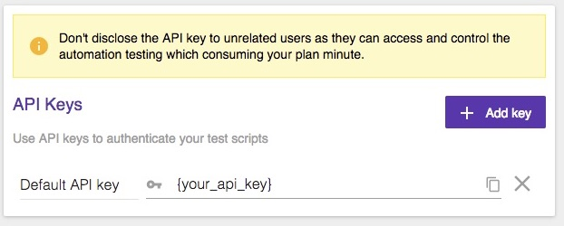
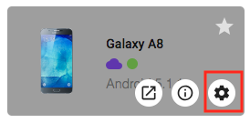

# Run Kobiton Automation Test on Travis CI

## Table of contents 
  - [Prerequisites](#prerequisites)
  - [1. Configure Travis CI with GitHub repository](#1-configure-travis-ci-with-github-repository)
  - [2. Configure automation test script](#2-configure-automation-test-script)
  - [3. Run automation script on Kobiton devices](#3-run-automation-script-on-kobiton-devices)
  - [4. Fetch session data through REST API](#4-fetch-session-data-through-REST-API)
  - [5. (Optional) Travis CI customization](#5-optional-travis-ci-customization)
  - [6. Feedback](#6-feedback)

## Prerequisites
  - Kobiton account
  
  Please visit https://portal.kobiton.com/register to create new account.

## 1. Configure Travis CI with GitHub repository

  Firstly, let's assume you already have an empty GiHub repository for running automation test.
  
  This part will guide you to configure Travis CI to integrate with your automation test GitHub repository. If you've already known how to get it done, please skip this step.
   > For instruction on how to sync GitHub repositories with Travis CI, follow [this guide.](https://docs.travis-ci.com/user/legacy-services-to-github-apps-migration-guide/)

  This documentation will use Node.js as the default language for the automation test script. Therefore, integrating Node.js plugin to Travis CI is required.
  > If you do not know how to integrate a Node JS app with Travis CI, follow [this tutorial.](https://docs.travis-ci.com/user/languages/javascript-with-nodejs/) 

## 2. Configure automation test script

  **2.1 Get username and API key**   
  Go to https://portal.kobiton.com and login to your Kobiton account.
  - Get username
    * Select *user icon* -> **"Profile"** (you might find it in the top right corner of the navigation bar)
  
    
  - Get API key
    * Select *user icon* -> **"Settings"**
  
    

  **2.2 Get desired capabilities**  
    The desired capabilities need to be added to the automation test script in order tests to be executed on the Kobiton device.

  Go to https://portal.kobiton.com and login to your Kobiton account.
  * In the top navigation bar, select **"Devices"**.
    
  * Hover over any device you want to test with and click on the Automation settings button (the gear symbol)   
  
    
  * You can choose your preferred language, app type. In this guideline, we will choose **"NodeJS"** for *Language* and **"Hybrid/Native from Apps"** for *App type*. Copy the code on the right to prepare for the next step.
  
    

  **2.3 Configure automation test project**
  
  Kobiton already provides some samples for automation test, visit [here](https://github.com/kobiton/samples) for reference.

  **In this guideline, we will use the `Node.js` sample (`samples/javascript` folder) as an example.**

  Copy the sample to your GitHub repository and edit your `.travis.yml` file like below:
  ```yml
  language: node_js
  node_js:
    - '7'

  script: <AUTOMATION_SCRIPT_RUN_COMMAND>
  ```
  > For example: using our provided sample, the automation script run command could be `npm run android-app-test` or `npm run ios-app-test`
  
  Open automation test script file in your repository or create a new one.

  Remember to add `kobitonServerConfig` and `desiredCaps` in your script with ones you got from the previous step.

  ```javascript
  const username = '<YOUR_KOBITON_USERNAME>'
  const apiKey = '<YOUR_KOBITON_API_KEY>'

  var kobitonServerConfig = {
    protocol: 'https',
    host: 'api.kobiton.com',
    auth: `${username}:${apiKey}`
  }

  var desiredCaps = {
    sessionName:        'Automation test session',
    sessionDescription: '', 
    deviceOrientation:  'portrait',  
    captureScreenshots: true, 
    app:                '<APP_URL>', 
    deviceGroup:        'KOBITON', 
    deviceName:         '<KOBITON_DEVICE_NAME>',
    platformVersion:    '<KOBITON_DEVICE_VERSION>',
    platformName:       '<DEVICE_PLATFORM_NAME>' 
  } 
  ```

>For more information on how to run automation test on Kobiton, visit:
  >- Kobiton documentation: https://docs.kobiton.com/automation-testing/automation-testing-with-kobiton/
  >- Kobiton blog: https://kobiton.com/blog/automation-web-appium-kobiton-nodejs/

## 3. Run automation script on Kobiton devices
 Push your changes to GitHub.

 Travis CI will install the neccessary dependencies and then run the test on Kobiton. 
  

  Go to https://portal.kobiton.con/sessions to check your testing session status.

  

## 4. Fetch session data through REST API
Kobiton already provides a Node.js sample on how to get session information using Kobiton REST API.

Go to https://github.com/kobiton/samples/rest-api and follow the instruction.

## 5. (Optional) Travis CI customization
### Secure your Kobiton API Key when triggering a Travis CI build

There are several methods to attach an enviroment variable to Travis CI.
In this guide, we will add our Username and API key to `.travis.yml` file. The API Key will be encrypted for security purposes.
  > To encrypt the variables, we need `Travis` package to be installed.  
  Execute the blow command to install Travis: `gem install travis`
    
1. In your repository directory, run:  
    `travis encrypt KOBITON_API_KEY=<YOUR_KOBITON_API_KEY> --add env.global`  
    This will add a secure encrypted key to your `.travis.yml`  
    Sample result:
    ```yml
    env:
      global:
        - secure: 'qU+dA2z60akrMEUor4wfjAb/9k9k6HI/Q7xBKpibQsu'
    ```
2. Add your Kobiton username to the yml file.
  
    ```yml
    env:
      global:
        - KOBITON_USERNAME=<YOUR_KOBITON_USERNAME>
        - secure: 'qU+dA2z60akrMEUor4wfjAb/9k9k6HI/Q7xBKpibQsu'
    ```

The final outcome of `.travis.yml` file should look like this:
  ```yml
  language: node_js
  node_js:
    - '7'

  env:  
    global:
      - KOBITON_USERNAME=<YOUR_KOBITON_USERNAME>
      - secure: 'qU+dA2z60akrMEUor4wfjAb/9k9k6HI/Q7xBKpibQsu'

  script: npm run android-app-test
  ```
  
  >For other methods to secure your enviromental variables, visit [here.](https://docs.travis-ci.com/user/environment-variables/)

3. Open your test script, replace your Kobiton username and API key with enviromental variable name in `kobitonServerConfig`.
    ```javascript
    const username = process.env.KOBITON_USERNAME
    const apiKey = process.env.KOBITON_API_KEY
    
    var kobitonServerConfig = {
      protocol: 'https',
      host: 'api.kobiton.com',
      auth: `${username}:${apiKey}`
    }
    ```

4. Push your changes to GitHub to verify the build in Travis CI.  
5. Travis CI will export your environment variables from `.travis.yml`. The encrypted key will be showed as `[secured]`.
  
  

## 6. Feedback
If you have any issue, you can contact Kobiton for more support.
- Go to https://portal.kobiton.com
- In the navigation bar at the top of the page, click on `Support`.


- Fill in the information for your request and submit your ticket. 
  
 
